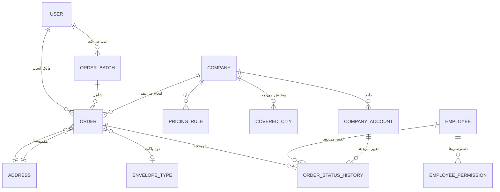

# بادرو (Badro)

پلتفرم مقایسه قیمت و ثبت سفارش ارسال مرسوله در ایران — هم پستی بین‌شهری، هم پیک درون‌شهری. مشتری مبدا/مقصد و مشخصات مرسوله را وارد می‌کند، قیمت چند شرکت طرف‌قرارداد را همزمان می‌بیند، و سفارش را بدون پرداخت آنلاین ثبت می‌کند (تسویه‌حساب مستقیم با شرکت در مبدا یا مقصد انجام می‌شود).

این سند برای کسی نوشته شده که تازه می‌خواد وارد کدبیس بشه. اگه سوالی با خوندن این فایل جواب داده نشد، بهترین نقطه‌ی شروع برای جستجو معمولاً `src/lib/` (منطق مشترک) یا `src/actions/` (نقطه‌ی ورود هر عملیات نوشتنی) هست.

## فهرست

1. [استک فنی](#استک-فنی)
2. [ساختار پروژه](#ساختار-پروژه)
3. [مدل داده و روابط جدول‌ها](#مدل-داده-و-روابط-جدولها)
4. [منطق محاسبه قیمت](#منطق-محاسبه-قیمت)
5. [لیست کامل صفحات و پنل‌ها](#لیست-کامل-صفحات-و-پنلها)
6. [اجرای پروژه به‌صورت لوکال](#اجرای-پروژه-به‌صورت-لوکال)
7. [دیپلوی](#دیپلوی-render--vercel-و-مشابه)
8. [نکات فاز بعد](#نکات-فاز-بعد-خارج-از-محدوده-فعلی)

---

## استک فنی

- **Next.js 16** (App Router + Turbopack) + TypeScript + Tailwind CSS v4 — توجه: این نسخه از Next.js چند تغییر رفتاری نسبت به نسخه‌های قدیمی‌تر داره (مثلاً middleware به proxy تغییر اسم داده — به `src/proxy.ts` نگاه کنید)
- **PostgreSQL + Prisma ORM 7** با driver adapter (`@prisma/adapter-pg`) — در Prisma 7 دیگه `datasource.url` تو `schema.prisma` نوشته نمی‌شه، بلکه از `prisma.config.ts` و متغیر محیطی خونده می‌شه
- **احراز هویت:** OTP پیامکی برای مشتری، یوزرنیم/پسورد برای کارمند و شرکت — هر سه با JWT (`jose`) ولی در سه کوکی کاملاً جدا از هم (یعنی هم‌زمان می‌شه با سه نقش مختلف تو یک مرورگر لاگین بود)
- **نقشه:** Leaflet / OpenStreetMap برای ثبت موقعیت آدرس روی نقشه
- **نمودار:** Recharts
- **آیکون:** lucide-react (SVG، نه ایموجی)
- **PWA:** `manifest.ts` + یک service worker دستی (`public/sw.js`)، بدون کتابخانه ثالث

## ساختار پروژه

```
src/
├── app/                      # همه‌ی صفحات و روت‌ها (Next.js App Router)
│   ├── (public)/             # صفحات عمومی بدون نیاز به نقش خاص (گروه route بدون تاثیر در URL)
│   ├── admin/                # پنل ادمین/کارمندان — layout خودش auth را چک می‌کند
│   ├── company/               # پنل شرکت‌های طرف‌قرارداد
│   ├── panel/                 # پنل مشتری
│   ├── api/debug/              # روت تشخیصی موقت برای عیب‌یابی اتصال دیتابیس — باید حذف شود
│   └── manifest.ts             # مانیفست PWA
├── actions/                   # Server Actions — تنها نقطه‌ی ورود عملیات نوشتنی (معادل لایه API)
│   ├── admin/                  # عملیات مخصوص پنل ادمین (شرکت‌ها، کارمندان، محتوا، سفارش‌ها)
│   ├── orders.ts                # ثبت سفارش مشتری (createOrderBatchAction) + استعلام با کد رهگیری
│   ├── company-orders.ts         # تغییر وضعیت سفارش از پنل شرکت
│   ├── quote.ts                  # محاسبه قیمت تقریبی (برای پیش‌نمایش در فرم صفحه اصلی)
│   ├── auth.ts                    # OTP، ورود/خروج هر سه نقش
│   ├── contact.ts, profile.ts      # فرم تماس با ما، ویرایش پروفایل مشتری
├── lib/
│   ├── pricing/                    # موتور قیمت‌گذاری (بخش ۴ همین سند)
│   ├── auth/                        # session (JWT هر نقش)، OTP، RBAC کارمندان
│   ├── sms/                          # لایه انتزاعی ارسال پیامک (فعلاً فقط mock)
│   ├── iran-locations.ts              # لیست استان/شهرستان‌های ایران (داده استاتیک)
│   ├── daily-buckets.ts, monthly-buckets.ts  # کمک‌تابع تقسیم بازه‌ی زمانی برای نمودارها
│   ├── tracking-code.ts                # تولید کد رهگیری یکتا (فرمت BD-XXXXXXXX)
│   ├── order-status.ts                  # برچسب فارسی وضعیت‌ها + مسیر مجاز تغییر وضعیت
│   ├── validation.ts                     # Zod schema های مشترک + فرمت‌کننده تومان
│   └── prisma.ts                          # singleton کلاینت Prisma (با adapter)
├── components/
│   ├── ui/                # کامپوننت‌های پایه (Input, Select, Button, Card, Toast)
│   ├── home/                # ویزارد صفحه اصلی (انتخاب پیک/پستی، مراحل آدرس، جزئیات مرسوله)
│   ├── order/                 # فرم آدرس مشترک، فرم ثبت سفارش، انتخاب روی نقشه
│   ├── panel/                   # اجزای مشترک بین هر سه پنل (Shell، نمودار، StatTile)
│   ├── admin/, company/           # فرم‌های اختصاصی هر پنل
│   ├── results/, tracking/, contact/, brand/, pwa/, auth/
├── generated/prisma/            # خروجی `prisma generate` — commit نمی‌شود، در build ساخته می‌شود
└── proxy.ts                       # میان‌افزار احراز هویت مسیرها (جایگزین middleware.ts قدیمی)

prisma/
├── schema.prisma      # مدل کامل داده
├── seed.ts             # داده اولیه idempotent (هر بار اجرا بی‌خطره، رکورد تکراری نمی‌سازه)
└── migrations/          # تاریخچه migration ها
```

### قواعد مهم معماری که باید رعایت بشه

- **نوشتن = Server Action، نه Route Handler.** به‌جز `api/debug` (که موقتیه)، هیچ API route واقعی نداریم. فرم‌ها مستقیم یک تابع `"use server"` از `src/actions/*` صدا می‌زنن.
- **مرز Server/Client کامپوننت را جدی بگیرید.** چند باگ واقعی در این پروژه دقیقاً از همین‌جا اومده: از یک Server Component (مثل `layout.tsx` یک پنل) نمی‌شه یک ارجاع تابع/کامپوننت (مثلاً یک آیکون lucide به‌عنوان type، نه رندرشده) به یک Client Component پاس داد — چون در پشت صحنه باید serialize بشه و توابع serialize نمی‌شن. همیشه یا آیکون/تابع را در همون Server Component رندر کنید و JSX نهایی رو پاس بدید، یا اون بخش رو خودش Client Component کنید.
- **سه کوکی session کاملاً جدا** (`badro_customer_session`, `badro_staff_session`, `badro_company_session`) — به `src/proxy.ts` و `src/lib/auth/session.ts` نگاه کنید.
- **RBAC کارمندان جدول‌محوره**، نه hardcode: هر کارمند (`Employee`) به‌ازای هر ماژول (`PermissionModule`) یک ردیف `EmployeePermission` با `canView`/`canEdit` داره. ادمین کامل (`isFullAdmin`) از این چک عبور می‌کنه. تابع مرکزی چک: `src/lib/auth/rbac.ts` → `hasPermission()`، و در سطح صفحه از `requireStaffView()` (`src/lib/auth/require-permission.ts`) استفاده می‌شه.

## مدل داده و روابط جدول‌ها

مدل کامل در `prisma/schema.prisma`. نمودار ساده‌شده روابط اصلی:



### توضیح مدل‌های کلیدی

| مدل | نقش |
|---|---|
| `User` | مشتری نهایی — با شماره موبایل شناسایی می‌شه، رمز عبور نداره (فقط OTP) |
| `Employee` | کارمند/ادمین بادرو — یوزرنیم/پسورد، `isFullAdmin` یا مجوزهای جدول‌محور |
| `Company` | شرکت پستی/پیک طرف‌قرارداد — `type` (`intercity`/`intracity`) مشخص می‌کنه چه نوع سرویسی می‌ده |
| `CompanyAccount` | حساب ورود پنل یک شرکت (چند حساب می‌تونن به یک شرکت وصل باشن، رابطه یک‌به‌چند) |
| `CoveredCity` | فقط برای شرکت‌های `intracity` معنا داره — لیست شهرهایی که پوشش می‌دن |
| `PricingRule` | فرمول/جدول قیمت هر شرکت (بخش بعد کامل توضیح داده شده) |
| `CityDistanceIndex` | فاصله‌ی تقریبی هر شهرستان از مرکز — مبنای محاسبه فاصله‌ی مبدا-مقصد |
| `EnvelopeType` | انواع پاکت قابل انتخاب در فرم (هرکدوم یک `priceModifier` ثابت دارن) |
| `Address` | یک رکورد آدرس عمومی؛ هر سفارش دو رابطه‌ی جدا به این جدول داره (مبدا/مقصد) |
| `OrderBatch` | چند مرسوله که هم‌زمان برای یک شرکت ثبت می‌شن یک batch می‌سازن (یک فرستنده، چند گیرنده) |
| `Order` | خودِ سفارش/مرسوله — شامل قیمت نهایی، کمیسیون، وضعیت فعلی |
| `OrderStatusHistory` | لاگ کامل تغییر وضعیت هر سفارش، همراه با اینکه چه نقشی (`ChangedByType`) تغییرش داده |
| `HomepageSlide` | اسلایدهای بالای صفحه اصلی — از `/admin/content` قابل مدیریته |
| `OtpCode` | کدهای OTP با `expiresAt` و `consumed` — هر مصرف یک‌بارمصرفه |

## منطق محاسبه قیمت

موتور قیمت در `src/lib/pricing/` هست و حول یک Interface مشترک طراحی شده تا بشه بعداً روش‌های دیگه اضافه کرد:

```ts
// src/lib/pricing/types.ts
interface PriceProvider {
  getQuote(input: PriceQuoteInput): Promise<PriceQuoteResult>;
}
```

سه پیاده‌سازی (`Company.pricingSourceType` تعیین می‌کنه کدوم استفاده بشه):

| مقدار | پیاده‌سازی | وضعیت |
|---|---|---|
| `internal_formula` | `internal-formula-provider.ts` | **فعال** — همه‌ی شرکت‌های نمونه از این استفاده می‌کنن |
| `external_api` | `external-api-provider.ts` | فقط Interface — همیشه «در دسترس نیست» برمی‌گردونه، منتظر مستندات API شرکت‌هاست |
| `page_automation` | `page-automation-provider.ts` | فقط Interface — برای فاز بعد (استخراج قیمت با Playwright از صفحه‌ی شرکت) |

### روش `internal_formula` (تنها روش فعال)

هر شرکت یک `PricingRule` با `ruleType` مشخص داره:

**۱. `formula` (فرمول ساده):**
```
قیمت = basePrice + (pricePerKg × وزن) + (pricePerKm × فاصله) + envelopeModifier
```
- `basePrice`, `pricePerKg`, `pricePerKm` در `PricingRule.formulaParams` (JSON) ذخیره می‌شن و از `/admin/companies/[id]` قابل ویرایش‌اند.
- **برای سرویس درون‌شهری (`intracity` / پیک موتوری)، جزء وزن همیشه صفره** — چون از مشتری وزن گرفته نمی‌شه؛ قیمت فقط از `basePrice` و فاصله ساخته می‌شه (`internal-formula-provider.ts`, متغیر `isIntracity`).

**۲. `tiered` (جدول پله‌ای):**
```
قیمت = tierPrice(وزن) × distanceFactor(فاصله) + envelopeModifier
```
- `weightTiers`: آرایه‌ای از `{minWeight, maxWeight, price}` — بازه‌ای که وزن توش قرار می‌گیره، قیمت پایه‌ی اون بازه رو می‌ده.
- `distanceFactors`: آرایه‌ای از `{minDistance, maxDistance, factor}` — ضریبی که قیمت پایه در اون ضرب می‌شه.
- این‌ها هم در `PricingRule.tiers` (JSON) ذخیره و از پنل ادمین قابل مدیریت‌اند.

### متغیرهای ورودی فرمول (`PriceQuoteInput`)

| متغیر | منبع |
|---|---|
| `weightKg` | ورودی مستقیم مشتری (فقط برای ارسال پستی؛ برای پیک موتوری اصلاً گرفته نمی‌شه) |
| فاصله (km) | **نه GPS واقعی** — از تفاضل `CityDistanceIndex.distanceFromCenterKm` مبدا و مقصد محاسبه می‌شه (`distance.ts`). برای درون‌شهری همیشه ۰. |
| `envelopePriceModifier` | اگه `parcelType === "envelope"`، از `EnvelopeType.priceModifier` خونده می‌شه |
| `parcelType`, `serviceType`, `originCity`, `destinationCity` | مستقیم از فرم مشتری |

نکته: `declaredValue` (ارزش اظهارشده‌ی مرسوله) در فرمول قیمت **هیچ اثری نداره** — فقط اطلاعاتی/برای بیمه‌ی احتمالی ثبت می‌شه.

### کمیسیون

بعد از محاسبه‌ی قیمت نهایی، کمیسیون بادرو جدا حساب می‌شه (`src/lib/pricing/commission.ts`):
```ts
commissionAmount = commissionType === "percent"
  ? Math.round(finalPrice * commissionValue / 100)
  : Math.round(commissionValue)
```
`commissionType` و `commissionValue` هم مشخصات هر `Company` هستن و از پنل ادمین قابل تنظیم‌اند.

### مسیر کامل یک استعلام قیمت

`src/lib/pricing/engine.ts` نقطه‌ی مرکزیه:
- `getQuotesForRequest()` — همه‌ی شرکت‌های فعالِ همون نوع سرویس (و برای درون‌شهری، فقط اونایی که `originCity` رو پوشش می‌دن) رو پیدا می‌کنه و از همه‌شون قیمت می‌گیره → برای `/results`
- `getQuoteForCompany()` — قیمت یک شرکت مشخص رو دوباره و امن سمت سرور حساب می‌کنه (هیچ‌وقت قیمت از کلاینت اعتماد نمی‌شه) → موقع ثبت نهایی سفارش در `createOrderBatchAction`
- `getApproximatePrice()` — ارزان‌ترین گزینه‌ی موجود، برای پیش‌نمایش «قیمت تقریبی» در فرم صفحه اصلی حین تایپ کاربر

## لیست کامل صفحات و پنل‌ها

### عمومی (بدون نیاز به ورود)

| مسیر | توضیح |
|---|---|
| `/` | صفحه اصلی — اسلایدر + ویزارد انتخاب سرویس و محاسبه قیمت |
| `/results` | نتایج مقایسه قیمت شرکت‌ها |
| `/order` | ثبت سفارش نهایی (خودِ صفحه نیاز به ورود مشتری داره، ولی مسیرش عمومیه) |
| `/order/confirmation` | تاییدیه بعد از ثبت سفارش |
| `/tracking` | پیگیری مرسوله با انتخاب شرکت + کد رهگیری، بدون نیاز به ورود |
| `/about`, `/contact`, `/rules` | صفحات ثابت |

### پنل مشتری (`/panel`, کوکی `badro_customer_session`)

| مسیر | توضیح |
|---|---|
| `/login` | ورود/ثبت‌نام مشتری با OTP موبایل |
| `/panel` | نمای کلی — آمار سفارش‌ها + نمودار |
| `/panel/orders`, `/panel/orders/[trackingCode]` | لیست و جزئیات سفارش‌های خودِ کاربر |
| `/panel/payments` | جمع مبلغ سفارش‌ها (چون پرداخت آنلاین نداریم، صرفاً برای شفافیته) |
| `/panel/profile` | ویرایش پروفایل |

### پنل ادمین/کارمندان (`/admin`, کوکی `badro_staff_session`)

| مسیر | توضیح | ماژول RBAC |
|---|---|---|
| `/admin/login` | ورود با یوزرنیم/پسورد | — |
| `/admin` | داشبورد کلی | `dashboard` |
| `/admin/companies`, `/companies/new`, `/companies/[id]` | مدیریت شرکت‌ها + فرمول قیمت + شهرهای پوشش | `companies` / `pricing` |
| `/admin/orders`, `/orders/[trackingCode]` | لیست و جزئیات همه‌ی سفارش‌ها، امکان تغییر وضعیت | `orders` |
| `/admin/commission-report`, `/commission-report/export` | گزارش ماهانه کمیسیون به تفکیک شرکت + نمودار فروش/کمیسیون روزانه + خروجی CSV | `commission_report` |
| `/admin/users`, `/users/[id]` | لیست و جزئیات مشتریان | `users` |
| `/admin/employees`, `/employees/new`, `/employees/[id]` | مدیریت کارمندان و دسترسی‌هاشون — **فقط `isFullAdmin`** | (خارج از RBAC عادی) |
| `/admin/content` | مدیریت اسلایدهای صفحه اصلی | (فقط `isFullAdmin`) |
| `/admin/no-access` | صفحه‌ی «دسترسی ندارید» وقتی کارمند مجوز یک ماژول رو نداره | — |

### پنل شرکت‌ها (`/company`, کوکی `badro_company_session`)

| مسیر | توضیح |
|---|---|
| `/company/login` | ورود با یوزرنیم/پسورد |
| `/company` | لیست سفارش‌های ارجاعی به این شرکت |
| `/company/orders/[trackingCode]` | جزئیات سفارش + تغییر وضعیت (`registered → confirmed → collecting → shipping → delivered`, یا لغو در هر مرحله) |
| `/company/reports` | گزارشات مالی: جدول سفارش/مبلغ/کمیسیون + جمع کل + نمودار فروش ۳۰ روز اخیر |

## اجرای پروژه به‌صورت لوکال

پیش‌نیاز: Node.js 20+، یک دیتابیس PostgreSQL در دسترس (لوکال یا از راه دور).

```bash
cp .env.example .env   # مقادیر DATABASE_URL و AUTH_SECRET را تنظیم کنید
npm install
npx prisma migrate dev # ساخت جداول روی دیتابیس (اولین بار مهاجرت‌ها را هم می‌سازد)
npx prisma db seed     # داده اولیه: شهرها، شرکت‌های نمونه، فرمول قیمت، حساب‌های تستی
npm run dev
```

سایت روی `http://localhost:3000` بالا می‌آید. `npx prisma db seed` **idempotent** است — هر چند بار که اجرا بشه رکورد تکراری نمی‌سازه (بر اساس عنوان/orderIndex/نام چک می‌کنه)، پس بی‌خطر می‌شه بعد از هر تغییر در `prisma/seed.ts` دوباره اجراش کرد.

اگه دیتابیس لوکال ندارید و فقط می‌خواید سریع بالا بیارید:
```bash
# با postgres نصب‌شده روی سیستم:
createuser badro --pwprompt
createdb badro -O badro
```
و `DATABASE_URL` رو مطابق همون بسازید (مثال کامل تو `.env.example` هست).

### حساب‌های تستی (بعد از seed)

| پنل | آدرس ورود | یوزرنیم | پسورد |
|---|---|---|---|
| ادمین | `/admin/login` | `admin` | `badro@admin1404` |
| شرکت (آزما پست) | `/company/login` | `azma-post` | `azma@1404` |
| مشتری | `/login` | فقط شماره موبایل — کد OTP پیامک واقعی نمی‌شه، در **کنسول همون ترمینالی که `npm run dev` توش اجراست** چاپ می‌شه (چون `SMS_PROVIDER=mock`) |

### دستورات مفید دیگر

```bash
npx prisma studio        # مرورگر گرافیکی دیتابیس
npx prisma migrate dev --name <توضیح>   # بعد از تغییر schema.prisma، مهاجرت جدید بساز
npm run lint              # ESLint
npx tsc --noEmit           # فقط type-check، بدون build
npm run build               # build تولیدی (شامل type-check کامل)
```

## دیپلوی (Render / Vercel و مشابه)

- `postinstall` به‌صورت خودکار `prisma generate` را اجرا می‌کند (لازم چون خروجی کلاینت پریسما در گیت commit نمی‌شود).
- `npm start` (`scripts/start.sh`) قبل از بالا آمدن سرور، خودش `prisma migrate deploy` و `prisma db seed` را اجرا می‌کند — نیازی به اجرای دستی این دستورها از طریق Shell نیست (مناسب پلن‌های رایگان Render که Shell ندارند). اگه migrate/seed شکست بخورن، سرور همچنان بالا می‌آید (تا سایت کامل از دسترس خارج نشه) و خطا فقط در لاگ چاپ می‌شه.
- **نکته Neon:** برای `DATABASE_URL` از کانکشن استرینگ **مستقیم** (بدون `-pooler` در هاست) استفاده کنید، نه نسخه Pooled. چون `prisma migrate deploy` از قفل‌های advisory استفاده می‌کند که PgBouncer (پشت کانکشن Pooled نئون) به‌طور کامل پشتیبانی نمی‌کند. برای یک سرویس همیشه-روشن مثل Render (برخلاف serverless) کانکشن مستقیم کاملاً کافی و ساده‌تر است.

## نکات فاز بعد (خارج از محدوده فعلی)

- نام و فرمول دقیق شرکت‌های واقعی (الان فقط داده نمونه seed شده)
- اتصال واقعی `external_api` / `page_automation` برای شرکت‌هایی که قیمتشون رو باید از بیرون گرفت
- درگاه پرداخت آنلاین، حساب کسب‌وکار، آپلود گروهی سفارش
- اپلیکیشن موبایل نیتیو
- اتصال به سرویس پیامک واقعی (کاوه‌نگار/ملی‌پیامک) — فقط جایگزینی کلاس `SmsProvider` در `src/lib/sms/provider.ts` لازمه، بقیه‌ی کد (تولید/چک OTP) دست‌نخورده می‌مونه
- حذف `src/app/api/debug` — یک روت تشخیصی موقت برای عیب‌یابی اتصال دیتابیس در دیپلوی اولیه بود و نباید برای همیشه روی سایت زنده بمونه
